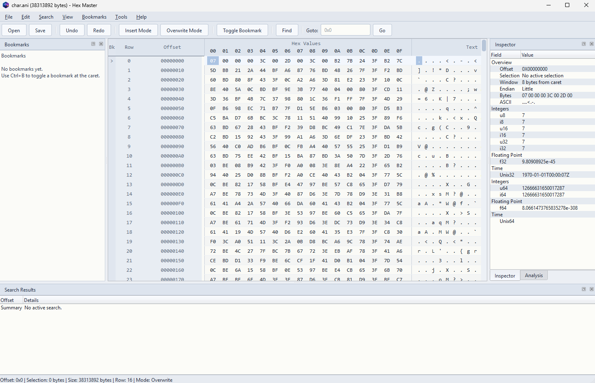

<p align="center">
  
</p>

# Hex Master

Hex Master is a Windows-first hex editor and binary file editor built with a Rust core and a Qt desktop shell.

It is designed as a modern desktop alternative to Hex Workshop for inspecting and editing binary data, executable files, save files, firmware images, and other raw byte-oriented formats, including large binary files and multi-GB data sets.



## Features

- hex-side and text-side editing
- insert and overwrite modes
- structural insert, delete, cut, and paste behavior
- typed inspector views for integer, floating-point, time, and IPv4 interpretations
- inline inspector editing for writable value types
- analysis dock with grouped checksum and digest tables
- byte-pattern, text, and typed-value search
- unified replace workflow for replace-next and replace-all
- search results table with match navigation
- loads and browses large binary files efficiently, including multi-GB data sets
- bookmarks, checksums, recent files, and session restore
- configurable viewport layout with persisted gutters, offsets, row numbers, and bytes-per-row

## Large File Handling

Hex Master is designed to work on large binary files without treating open as a full-buffer load into the UI.

- the viewport reads only the visible region plus a bounded cache window instead of materializing the entire file for display
- scrolling, inspection, and navigation operate on targeted range reads, which keeps startup fast even on multi-GB files
- search scans the file in chunks rather than building one giant in-memory search buffer
- save writes data in chunks with progress reporting, which keeps memory use controlled during large writes

This is mainly a practical engineering choice: keep the desktop shell responsive, avoid unnecessary memory growth, and make large-file work predictable on ordinary machines.

## Download

Project site:

- https://majimboo.github.io/hex-master/

Releases:

- https://github.com/majimboo/hex-master/releases

When a tagged release is published, the Windows package will be available as:

- `HexMaster-windows-x64-vX.Y.Z.zip`

After extracting that archive, run:

- `HexMaster.exe`

## Platform Support

- Windows: primary supported release target
- Linux: source build may be possible with Qt 6 and a native toolchain, but packaged releases are not set up yet
- macOS: source build may be possible later, but packaged releases are not set up yet

## Build From Source

Prerequisites:

- Rust toolchain
- CMake 3.27+
- Qt 6 for MSVC on Windows
- Visual Studio 2022 build tools or full IDE

Debug build:

```powershell
.\scripts\build.ps1
```

Release build:

```powershell
.\scripts\build.ps1 -Configuration Release
```

Rust-only build:

```powershell
.\scripts\build.ps1 -SkipQt
```

## License

This project is licensed under the MIT License. See [LICENSE](LICENSE).

## Author

Created by Majid Siddiqui  
me@majidarif.com  
2026
